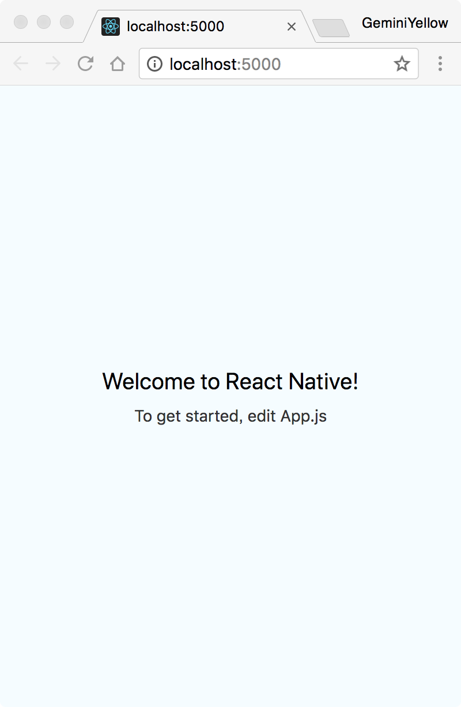

# React Native Web

## Dev Dependencies

- [Babel](https://babeljs.io/)
- [Webpack](https://webpack.js.org/)
- [webpack-dev-server](https://github.com/webpack/webpack-dev-server/)
- [React Native for Web](https://github.com/necolas/react-native-web/)

## Getting started

- [Web packaging for existing React Native apps](https://github.com/necolas/react-native-web/blob/master/website/guides/getting-started.md#web-packaging-for-existing-react-native-apps)



## Scripts (optional)

Add following scripts into your `package.json#scripts`.

```shell
"build": "webpack --mode production --config './web/webpack/development.js'",
"dev": "webpack-dev-server --mode development --config './web/webpack/development.js' --hot",
```