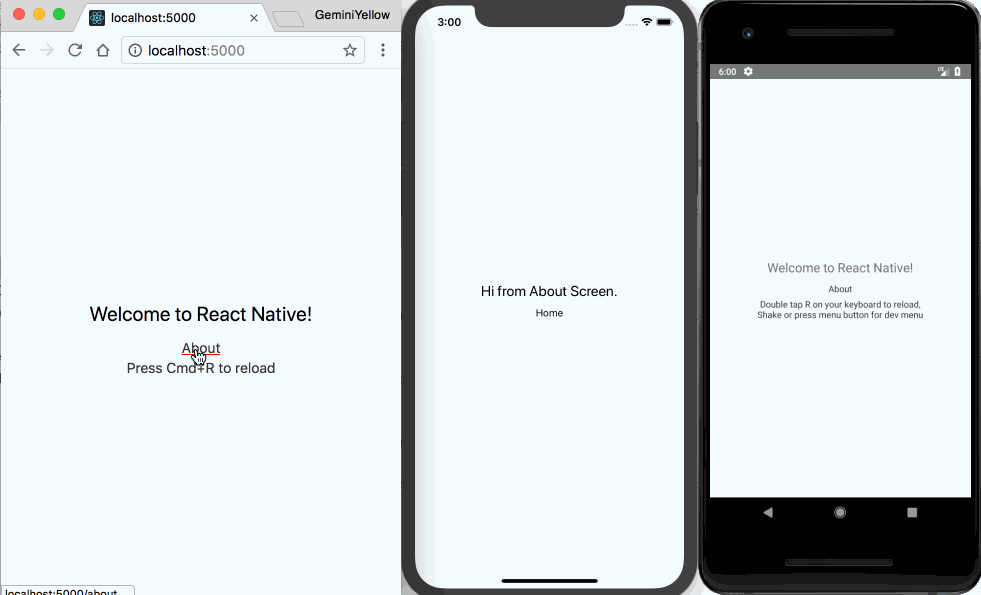

# React Router( Native)

## Dev Dependencies

- [React Router](https://reacttraining.com/react-router/)
- [React Native#Platform](https://facebook.github.io/react-native/docs/platform-specific-code.html)

## Getting Started

### Installation

```package.json
npm install react-router-native react-router-dom react-router
```

### Configuration

Add `/node_modules\/react-router/` to your webpack config file.

```webpack.config.js
  /node_modules\/react-router/,
```

### Create a universe router

Just look `common` and `react-router` under the `/src/utils` folder.

### Success

