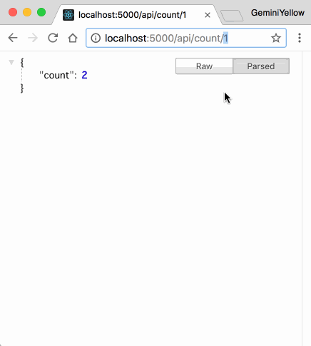

# Webpack Dev Server

## Dev Dependencies

- [webpack/webpack-dev-server](https://github.com/webpack/webpack-dev-server)
- [expressjs/expressjs.com](https://github.com/expressjs/expressjs.com)

## Getting Started

Read webpack dev server's official document: [Getting Started](https://github.com/webpack/webpack-dev-server#getting-started),
and then config your mock api follow the express's api in [here](https://expressjs.com/en/4x/api.html#app). 
It is very simple. Trust yourself, you can start it in 5 min.

